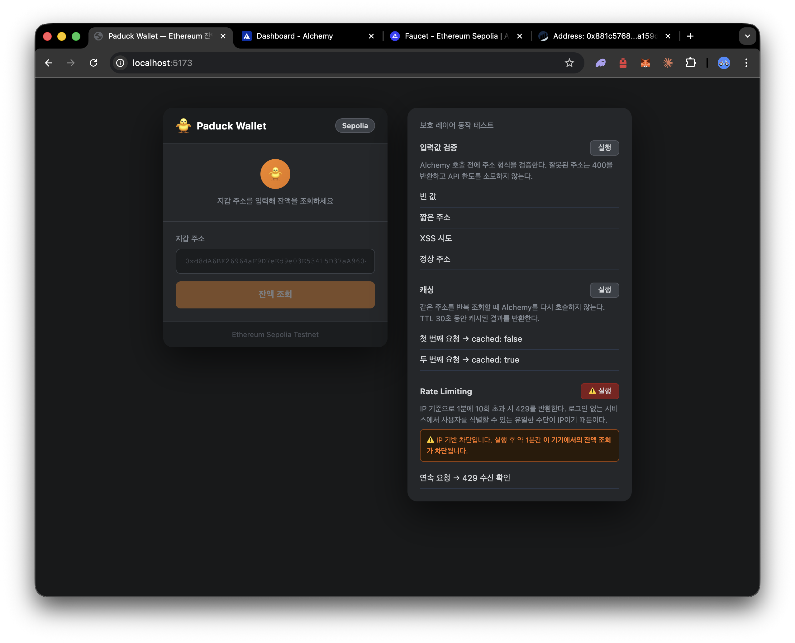
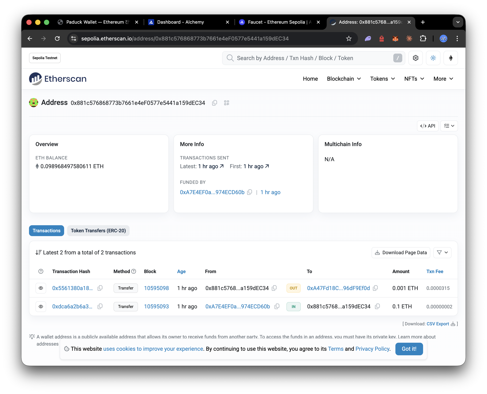
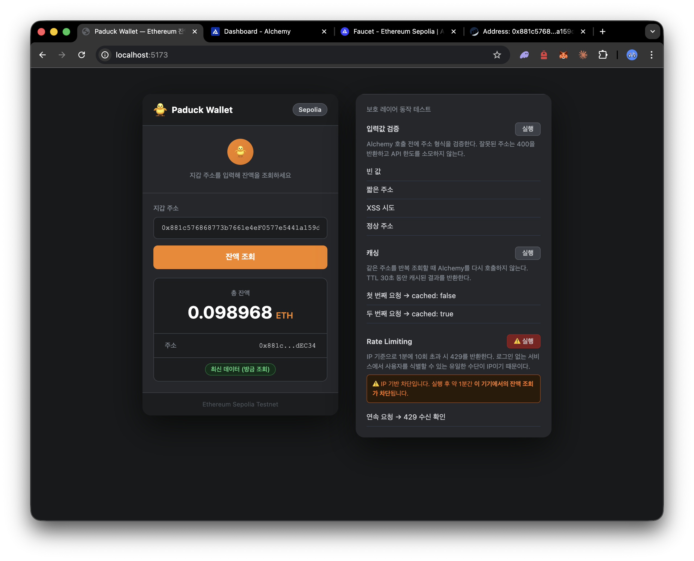
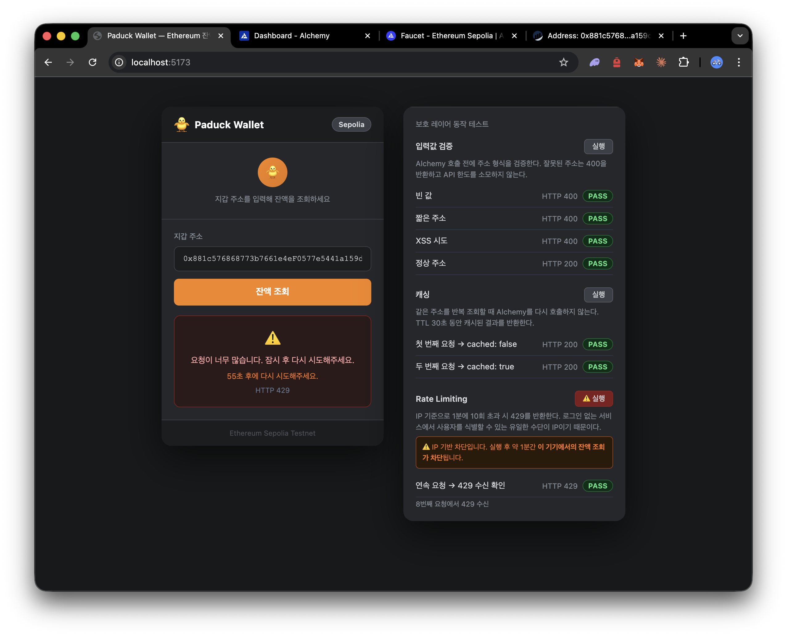

# Eth Paduck Wallet

Ethereum Sepolia 테스트넷 지갑 잔액 조회 서비스.  
백엔드가 Alchemy API 키를 숨기고 중계하는 구조로, RPC 자원 남용을 막는 것이 핵심이다.  


---

## 화면

**첫 화면 — 지갑 주소 입력 / 오른쪽에 보호 레이어 테스트 패널**



**Etherscan — 조회에 사용한 예시 지갑 주소의 온체인 상태**



**잔액 조회 결과 — 최신 데이터 여부(캐시)와 함께 표시**



**테스트 완료 — 입력값 검증/캐싱 PASS, Rate Limiting 작동 확인 후 IP 차단된 상태**



---

## 이 프로젝트를 만든 과정

### 시작: 뭘 모르는지도 몰랐다

지갑을 처음 만들어보는 상황이다. 지갑이 공개키/개인키로 만들어진다는 건 알았지만, 실제 서비스에서 어떻게 잔액을 조회하는지는 몰랐다. Node.js나 Express도 Flask와 비슷한 거라는 건 알면서도 직접 짜본 적이 없었다.

일단 구현부터 시작하기보다 도메인을 이해하는 것이 먼저라고 판단했다.

### 학습: theory 파일로 배경 지식을 채웠다

`theory/` 폴더에 직접 정리하면서 공부했다.

- **Alchemy가 왜 필요한가**: 브라우저는 이더리움 노드에 직접 접근할 수 없다. 누군가 노드를 운영하고 RPC로 접근을 열어줘야 한다. Alchemy가 그 역할이다.
- **왜 API 키가 노출되는가**: 프론트엔드 JS는 브라우저에 파일째로 전달된다. HTTPS가 전송을 암호화해도 코드 자체는 개발자 도구로 누구나 볼 수 있다. 키를 클라이언트 단에서 코드에 박으면 안에 탈취된다.
- **어떤 공격이 가능한가**: 키 탈취뿐 아니라, 키를 몰라도 우리 서버 주소만 알면 무차별 요청으로 Alchemy 한도를 소모시킬 수 있다.
- **어떻게 막는가**: 입력값 검증, rate limiting, 캐싱. 각각 Alchemy를 호출하기 전에 요청을 거르는 레이어다.

### 설계: 보호 흐름을 먼저 그렸다

코드보다 흐름을 먼저 정리했다.

```
요청 → 입력값 검증 → Rate limit → 캐시 확인 → Alchemy 호출 → 캐시 저장 → 응답
```

각 단계에서 걸리면 Alchemy를 아예 호출하지 않는 구조다. 비용이 발생하는 지점을 최대한 뒤로 미룬 것이다.

### 구현: 낯선 스택이었지만 구조는 알고 있었다

Node.js와 Express, React를 처음 제대로 써봤다. Python/Flask와 개념이 같아서 구조를 이해하는 건 어렵지 않았다. 모르는 부분은 왜 그렇게 되는지 이해하면서 채워갔다.

의존성은 최소한으로 유지했다. rate limiting은 `express-rate-limit` 없이 직접 구현했고, 캐싱은 Redis 없이 인메모리 Map으로 처리했다. 이 규모에서 외부 라이브러리가 꼭 필요한지 판단했을 때 필요 없다고 봤다.

### 테스트: 보호 레이어가 실제로 작동하는지 눈으로 확인하고 싶었다

curl로 동작은 확인했지만, 보호 레이어 각각이 의도대로 작동하는지 직접 보여줄 수 있으면 좋겠다고 생각했다. 그래서 프론트에 테스트 패널을 만들었다.

- 잘못된 주소 → 400 반환 확인
- 같은 주소 두 번 조회 → 두 번째는 캐시 응답 확인
- 연속 요청 → 429 반환 확인 (IP 기반이라 테스트 후 1분간 차단됨)

### 솔직한 한계

완전히 이해했다고 말하기 어려운 부분도 있다. Vite 프록시가 왜 필요한지 개념은 잡았지만, 실제 배포 환경에서 Nginx로 대체하는 구조는 직접 해본 적 없다. rate limiting의 IP 기반 방식이 VPN으로 우회 가능하다는 것도 알고 있다. 더 정밀한 보호는 인증 시스템이 있어야 가능하다.

이 프로젝트는 완벽한 보안보다, 낯선 도메인에서 핵심 문제를 파악하고 실용적인 수준의 방어를 설계하는 과정에 집중했다.

---

## 실행 방법

### 사전 준비

1. [Alchemy](https://alchemy.com) 계정 생성 → Sepolia 앱 생성 → HTTPS URL 복사
2. 환경변수 설정:
   ```bash
   cd backend
   cp .env.example .env
   # .env 파일을 열고 ALCHEMY_URL에 실제 URL 입력
   ```
3. 의존성 설치:
   ```bash
   cd backend && npm install
   cd frontend && npm install
   ```

### 실행

루트 디렉토리에서:
```bash
./start.sh   # 백엔드(5001) + 프론트엔드(5173) 동시 실행
./stop.sh    # 서버 종료
```

브라우저에서 `http://localhost:5173` 접속.

### API 직접 테스트 (curl)

```bash
# 잔액 조회
curl "http://localhost:5001/api/balance?address=0xd8dA6BF26964aF9D7eEd9e03E53415D37aA96045"

# 잘못된 주소
curl "http://localhost:5001/api/balance?address=hello"

# 헬스체크
curl "http://localhost:5001/health"
```

---

## 전체 요청 흐름

```
사용자 (브라우저)
    │
    │  주소 입력
    ▼
[AddressInput.jsx]
    │  0x + 40자리 형식 검증 (UX용, 보안은 백엔드가 담당)
    ▼
[api.js]
    │  GET /api/balance?address=0x...
    ▼
[Vite 프록시] ── localhost:5173 → localhost:5001 로 전달
    ▼
[validate.js]
    │  ethers.isAddress()로 주소 형식 + 체크섬 검증
    │  통과 시 정규화된 주소를 req.normalizedAddress에 저장
    ▼
[rateLimit.js]
    │  IP 기반, 1분에 10회 제한
    │  초과 시 429 + Retry-After 반환
    ▼
[balance.js]
    │  캐시 확인 → 히트 시 즉시 반환 (Alchemy 호출 없음)
    │  미스 시 Alchemy 호출
    ▼
[blockchain.js]
    │  ethers.js → Alchemy → 이더리움 노드
    │  잔액(wei) 조회 후 ETH로 변환
    ▼
[cache.js]
    │  결과를 30초간 캐시 저장
    ▼
[balance.js]
    │  { address, balance, unit, cached, cachedAt } 반환
    ▼
[BalanceDisplay.jsx]
    │  잔액 화면에 표시
    ▼
사용자 (결과 확인)
```

---

## 파일 구조

```
Eth_paduck_wallet/
├── backend/
│   ├── src/
│   │   ├── server.js              # 진입점. app.js를 포트에 올린다.
│   │   ├── app.js                 # Express 설정. 미들웨어, 라우터 등록.
│   │   ├── config.js              # 환경변수 로드·검증.
│   │   ├── middleware/
│   │   │   ├── validate.js        # 입력값 검증 (ethers.isAddress)
│   │   │   └── rateLimit.js       # IP 기반 rate limiting (직접 구현)
│   │   ├── services/
│   │   │   ├── cache.js           # 인메모리 캐시 (TTL 30초)
│   │   │   └── blockchain.js      # Alchemy RPC 호출 (ethers.js)
│   │   └── routes/
│   │       └── balance.js         # GET /api/balance 라우트
│   └── .env.example
├── frontend/
│   ├── src/
│   │   ├── main.jsx               # React 진입점
│   │   ├── App.jsx                # 루트 컴포넌트. 상태 관리.
│   │   ├── App.css                # 스타일
│   │   ├── services/
│   │   │   └── api.js             # 백엔드 fetch 호출
│   │   └── components/
│   │       ├── AddressInput.jsx   # 주소 입력 + 클라이언트 검증
│   │       └── BalanceDisplay.jsx # 결과 표시 (성공/에러)
│   └── vite.config.js             # Vite 설정. /api 요청을 백엔드로 프록시.
├── start.sh                       # 서버 실행 스크립트
├── stop.sh                        # 서버 종료 스크립트
└── DESIGN.md                      # 설계 결정 상세 문서
```

---

## 설계 판단

### 왜 백엔드가 중계하는가

클라이언트가 Alchemy에 직접 요청하면 브라우저 개발자 도구로 API 키를 즉시 확인할 수 있다.
탈취된 키로 공격자가 RPC 자원을 무제한 소모할 수 있으므로, 백엔드가 키를 숨기고 중계한다.

### 보호 레이어와 선택 이유

| 레이어 | 구현 | 선택 이유 |
|--------|------|---------|
| 입력값 검증 | ethers.isAddress() | 형식 + EIP-55 체크섬까지 검증. ethers.js는 이미 사용 중이라 추가 의존성 없음. |
| Rate Limiting | 직접 구현 (고정 윈도우, IP 기반, 1분 10회) | express-rate-limit 없이 의존성 최소화. 동작 원리 직접 제어. |
| 캐싱 | 인메모리 Map (TTL 30초) | Redis 없이 단일 서버에서 충분. Sepolia 블록 주기(12초) 고려한 TTL. |
| 주소 정규화 | ethers.getAddress() | 대소문자 변형이 동일 캐시 키를 참조하게 해 중복 호출 방지. |

### 대응한 위협 시나리오

| 시나리오 | 대응 |
|---------|------|
| API 키 탈취 | 백엔드 중계 — 키는 서버 환경변수에만 존재 |
| 무차별 반복 호출 | Rate limiting — 1분 10회 초과 시 429 |
| 잘못된 주소 도배 | 입력값 검증 — Alchemy 호출 전 차단 |
| 동일 주소 반복 조회 | 캐싱 — TTL 30초간 Alchemy 미호출 |
| 캐시 오염 (대소문자 변형) | 주소 정규화 — 동일 캐시 키로 수렴 |
| 내부 정보 노출 | 에러 포장 — 상세는 서버 로그, 클라이언트엔 일반 메시지 |

### 의식적으로 선택한 한계

- **IP rate limiting**: VPN으로 우회 가능. 로그인 없이는 더 정밀한 식별 불가.
- **인메모리 캐시**: 서버 재시작 시 초기화. 다중 서버 환경에서는 동작 안 함.
- **고정 윈도우**: 윈도우 경계에서 최대 20회 허용될 수 있음.

---

## 기술 스택

| 역할 | 기술 |
|------|------|
| 백엔드 | Node.js + Express |
| Ethereum 통신 | ethers.js v6 |
| 환경변수 | dotenv |
| 프론트엔드 | React + Vite |
| RPC 제공자 | Alchemy (Sepolia) |

**의도적으로 추가하지 않은 것:**
- `express-rate-limit` — 직접 구현으로 의존성 최소화
- `Redis` — 단일 서버에서 인메모리 캐시로 충분
- CSS 프레임워크 — 불필요한 의존성
